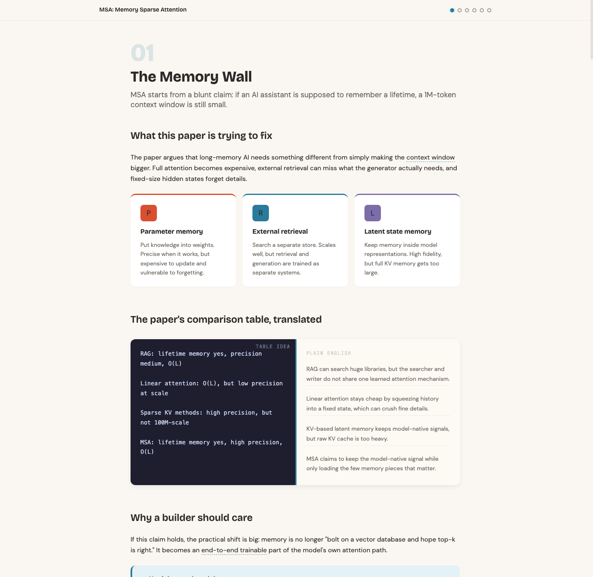
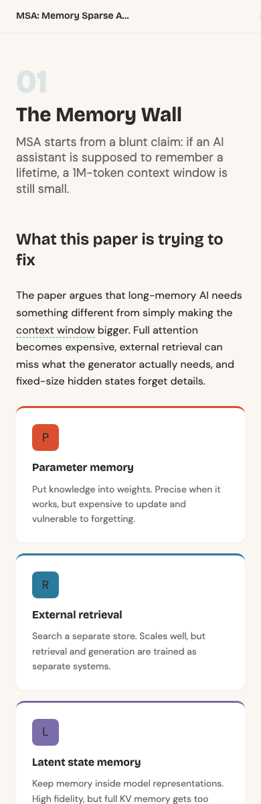

# Paper2Course

A Codex skill that turns AI papers into bilingual, interactive courses.

Point it at a paper. Get back a polished English/Chinese HTML course that teaches what the paper claims, how the method works, what the experiments actually prove, and what a skeptical builder should test next.



## Why This Exists

AI papers are dense in a very particular way. The hard part is rarely just "what does this paragraph say?" The hard part is building the right mental model:

- What problem is this paper really solving?
- What changed compared with RAG, fine-tuning, agents, long context, or previous systems?
- Which equation, table, or ablation is actually load-bearing?
- What does the paper prove, and what does it merely suggest?
- If I asked an AI agent to implement this, what should I tell it to build first?

Paper2Course turns that reading process into a course. It starts from the paper's motivation, walks through the mechanism visually, translates formulas and tables into plain language, tests understanding with applied quizzes, and ends with a high-level synthesis plus FAQ.

## What The Course Looks Like

The generated course is a static website. No backend. No build server. Open it directly or host it anywhere static pages work.

It includes:

- **Bilingual pages** — `index.html` for English and `index.zh.html` for Chinese, with a nav switch
- **Scroll-based modules** with progress dots and keyboard navigation
- **Formula / table / algorithm -> plain language translations**
- **Applied quizzes** that test judgment rather than memorized terms
- **Method and data-flow animations**
- **Research-meeting style chats** between model components, datasets, losses, baselines, or evaluators
- **Glossary tooltips** for technical terms
- **Final synthesis and FAQ** to resolve the big conceptual confusions
- **A warm closing note** that reinforces confident, skeptical paper reading



## Who This Is For

Paper2Course is for practical AI builders, product-minded researchers, and vibe coders who want to read AI papers well enough to use them.

It is especially useful if you want to:

- understand a paper without getting trapped in notation
- compare a method against RAG, fine-tuning, long-context models, agents, or systems tricks
- identify whether an experiment really supports the paper's claim
- prompt AI coding/research agents with sharper technical instructions
- decide what would be expensive, fragile, or worth testing first

## Example Prompts

```text
Use $paper2course to turn this arXiv paper into an interactive course:
https://arxiv.org/pdf/2603.23516
```

```text
把这篇 AI paper 做成中英双语互动课程：./paper.pdf
```

```text
Use $paper2course on this paper plus official repo and explain what I should trust, test, and be skeptical about.
```

## Install

Clone this repository into your Codex skills directory:

```bash
git clone https://github.com/clearchen666/paper2course ~/.codex/skills/paper2course
```

Restart Codex so the skill is discovered.

You can also ask Codex to install it for you:

```text
Install the skill from https://github.com/clearchen666/paper2course into ~/.codex/skills/paper2course
```

After installation, try:

```text
Use $paper2course to turn this AI paper into an interactive course: <paper URL or PDF path>
```

## Output Structure

Each course is generated as a directory:

```text
paper-course-name/
  styles.css
  main.js
  _base.html
  _base.zh.html
  _footer.html
  build.sh
  notes/
    analysis.md
  modules/
    01-problem.html
    ...
  modules-zh/
    01-problem.html
    ...
  index.html
  index.zh.html
```

Open `index.html` for English or `index.zh.html` for Chinese. The two pages share the same interaction engine and course structure.

## Design Philosophy

### Read for judgment, not just summary

A useful paper walkthrough should tell you what to believe, what to doubt, and what to try. Paper2Course treats every paper as a set of claims, mechanisms, and evidence, not as a pile of paragraphs to summarize.

### Translate the load-bearing artifacts

If the paper's argument depends on an equation, algorithm, figure, table, or ablation, the course translates that artifact into plain language. The goal is not to remove technical detail; it is to make the technical detail usable.

### End with the big picture

The final module includes a synthesis and FAQ so the learner leaves with a stable mental model. For example: what is trained once, what changes per user or corpus, where memory is stored, how the method differs from RAG, and what should be tested first.

## Credit

Paper2Course is adapted from Zara Zhang's excellent [`codebase-to-course`](https://github.com/zarazhangrui/codebase-to-course).

The original project established the interactive course format, warm developer-notebook visual direction, scroll-based modules, quiz patterns, group chat/data-flow animations, glossary tooltips, and code-to-English translation blocks. Paper2Course extends that foundation from codebases to AI academic papers, adding paper-specific analysis, bilingual English/Chinese output, final synthesis/FAQ sections, and research-reading pedagogy.

All credit for the original concept and course interaction foundation goes to Zara Zhang and `codebase-to-course`.

## Licensing Note

This repository intentionally does not add a separate open-source license at this time. The upstream `codebase-to-course` repository did not declare a license when this project was created, so this repo preserves explicit attribution and avoids making broader license claims.
